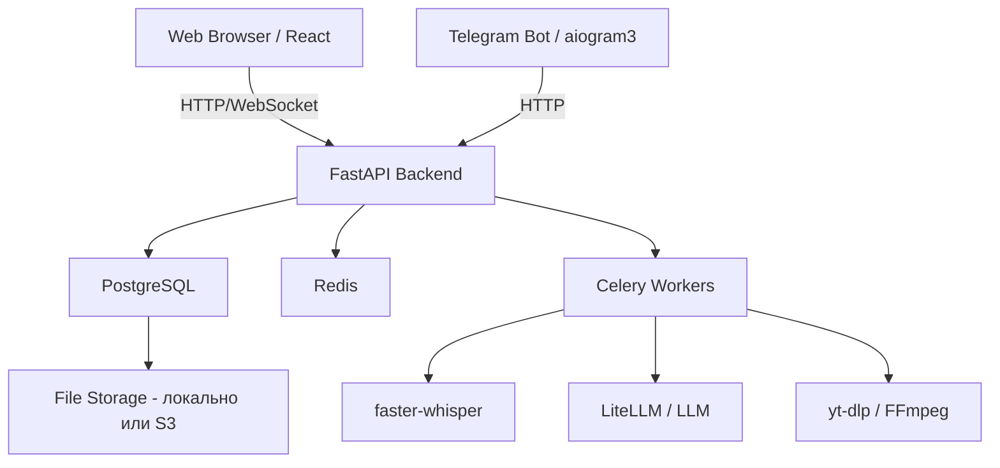
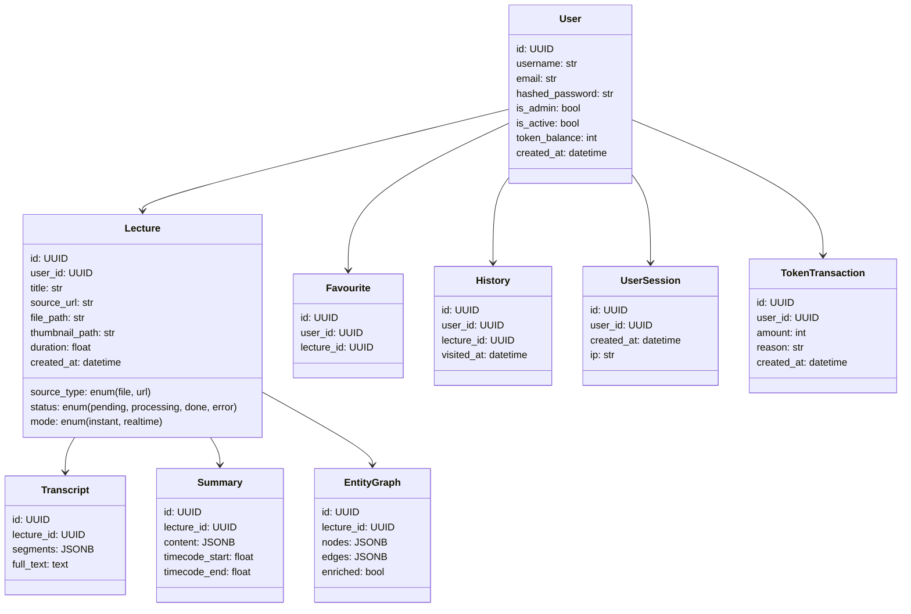
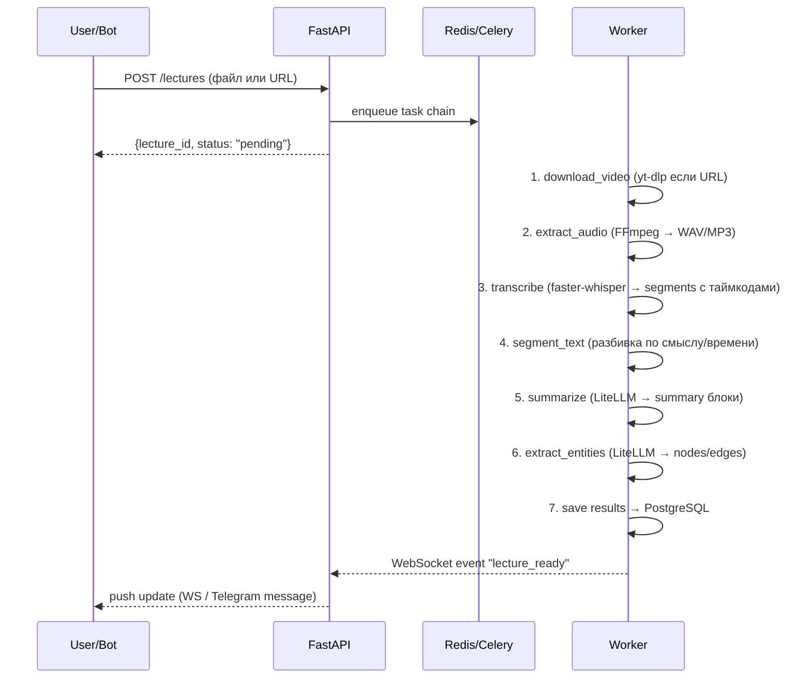
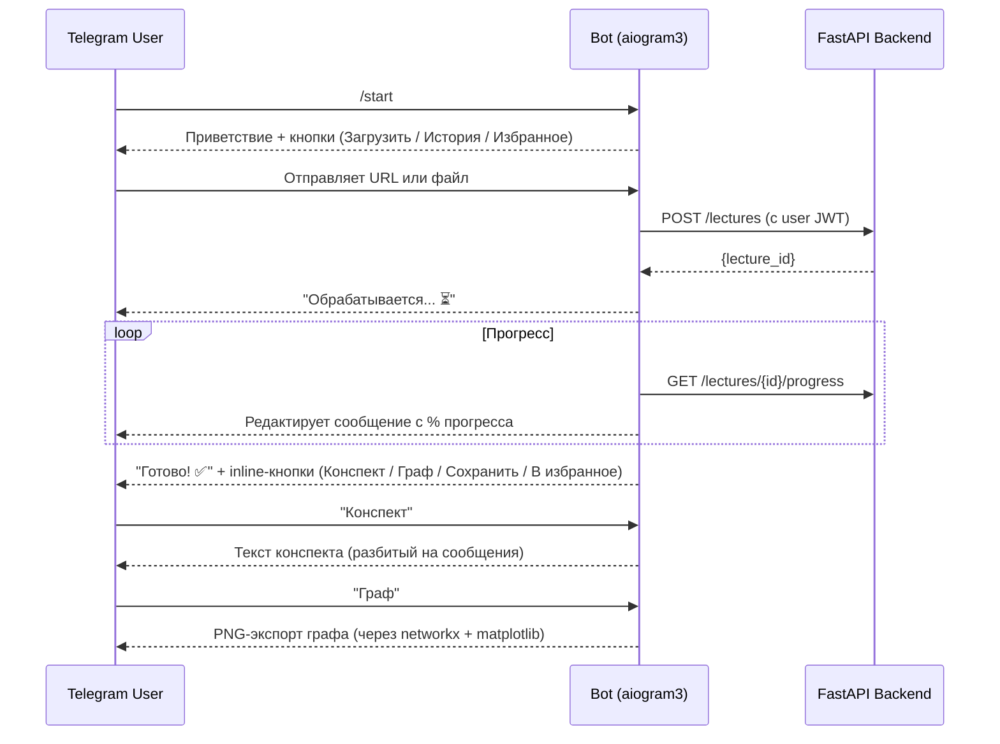

I have created the following plan after thorough exploration and analysis of the codebase. Follow the below plan verbatim. Trust the files and references. Do not re-verify what's written in the plan. Explore only when absolutely necessary. First implement all the proposed file changes and then I'll review all the changes together at the end.

## Наблюдения

Проект начинается с нуля — рабочая директория `c:\Users\bobro\Desktop\practice\` пуста. Требуется построить полноценную систему: транскрипция видео → конспект → граф сущностей, с web-интерфейсом, Telegram-ботом, мультипользовательским режимом и admin-панелью.

## Подход

Используем **FastAPI** (async backend) + **React** (web SPA) + **PostgreSQL** (основная БД) + **Redis** (очереди задач через Celery) + **aiogram 3** (Telegram-бот). Это проверенная связка для асинхронной многопользовательской работы с долгими задачами. Для транскрипции — **faster-whisper** (быстрее оригинального Whisper, поддерживает русский). LLM — через **LiteLLM** (единый интерфейс к OpenAI, Ollama, и др.).

---

## Архитектура системы



---

## Структура проекта

```
practice/
├── backend/
│   ├── app/
│   │   ├── api/            # FastAPI роутеры
│   │   ├── models/         # SQLAlchemy модели
│   │   ├── schemas/        # Pydantic схемы
│   │   ├── services/       # Бизнес-логика
│   │   ├── tasks/          # Celery задачи
│   │   ├── core/           # Конфиг, безопасность, зависимости
│   │   └── db/             # Инициализация БД, миграции (Alembic)
│   ├── requirements.txt
│   └── celery_app.py
├── frontend/               # React приложение
│   ├── src/
│   │   ├── pages/
│   │   ├── components/
│   │   └── api/
│   └── package.json
├── telegram_bot/           # aiogram3 бот
│   ├── handlers/
│   ├── keyboards/
│   └── bot.py
├── docker-compose.yml
└── .env
```

---

## Технологический стек

| Компонент | Технология |
|---|---|
| Backend | Python 3.11, FastAPI, SQLAlchemy 2.0 (async) |
| БД | PostgreSQL 16 |
| Очереди | Celery + Redis |
| Транскрипция | faster-whisper |
| LLM | LiteLLM (OpenAI / Ollama / local) |
| Загрузка видео | yt-dlp, FFmpeg |
| Telegram-бот | aiogram 3 |
| Frontend | React 18, TypeScript, Vite |
| Граф | Vis.js (react-vis-graph2d) |
| Графики admin | Recharts |
| Хранилище файлов | Локальная ФС / MinIO (S3-compatible) |
| Авторизация | JWT (python-jose) + OAuth2 |
| Контейнеризация | Docker + docker-compose |

---

## Шаги реализации

### Шаг 1 — Инфраструктура и БД

**Схема БД (PostgreSQL, SQLAlchemy async models):**



- Создать `docker-compose.yml` с сервисами: `postgres`, `redis`, `backend`, `celery_worker`, `frontend`, `telegram_bot`
- Настроить Alembic для миграций в `backend/app/db/`
- Хранение файлов (видео, аудио, превью): отдельная директория `media/`, путь в БД
- JSONB поля для `segments` (таймкоды + текст), `nodes`/`edges` графа, `content` конспекта

---

### Шаг 2 — Аутентификация и управление пользователями

- В `backend/app/core/security.py`: JWT-токены (access + refresh), хеширование паролей через `passlib[bcrypt]`
- В `backend/app/api/auth.py`: роутеры `/register`, `/login`, `/refresh`
- Dependency `get_current_user` и `require_admin` для защиты эндпоинтов
- Admin-only эндпоинты: создание/деактивация пользователей, выдача токенов

---

### Шаг 3 — Pipeline обработки видео (Celery Tasks)

Последовательность задач в `backend/app/tasks/`:



- **Докачка (опционально)**: перед шагом 1 проверять наличие файла по хешу/URL в БД — пропускать уже выполненные шаги, используя статус каждого этапа в модели `Lecture`
- **Прогресс-бар**: каждый шаг worker'а обновляет поле `processing_progress` (0–100) в Redis, FastAPI отдаёт его через WebSocket и SSE
- **Realtime-режим**: для кейса 2 — после каждого N-секундного сегмента транскрипции сразу запускать summarize и extract_entities, публиковать результат через WebSocket

---

### Шаг 4 — LLM интеграция

В `backend/app/services/llm_service.py` через **LiteLLM**:

- **Промпт для Summary**: инструктирует модель выделять главные мысли, определения, даты, выводы и разбивать на логические блоки
- **Промпт для Entity Extraction**: NER-промпт для поиска именованных сущностей (термины, персоналии, теории) и связей между ними; если пользователь указал нужные сущности — передаются в промпт как фильтр
- **Обогащение (галочка "расширяющая информация")**: отдельный промпт, запрашивающий у LLM связанные концепции, не упомянутые в лекции — добавляются как отдельный тип узлов/блоков с флагом `enriched: true`
- Конфигурация модели (OpenAI / Ollama / другие) через `.env` и `backend/app/core/config.py` — пользователь/admin выбирает провайдера

---

### Шаг 5 — FastAPI эндпоинты

В `backend/app/api/`:

| Группа | Эндпоинты |
|---|---|
| Auth | `POST /auth/login`, `/auth/register`, `/auth/refresh` |
| Lectures | `POST /lectures`, `GET /lectures/{id}`, `GET /lectures/{id}/progress` (SSE/WS) |
| Transcript | `GET /lectures/{id}/transcript` |
| Summary | `GET /lectures/{id}/summary` |
| Graph | `GET /lectures/{id}/graph`, `POST /lectures/{id}/graph/enrich` |
| Favourites | `GET/POST/DELETE /favourites` |
| History | `GET /history` |
| Export | `GET /lectures/{id}/export?format=pdf\|json\|md` |
| Admin | `GET /admin/users`, `POST /admin/users`, `GET /admin/stats/users`, `GET /admin/stats/visits`, `GET /admin/stats/db` |
| Accuracy | `POST /admin/accuracy-eval` |
| Tokens | `GET /tokens/balance`, `POST /admin/tokens/issue` |

- WebSocket эндпоинт `WS /ws/{lecture_id}` для push прогресса и realtime-обновлений

---

### Шаг 6 — Web-интерфейс (React)

В `frontend/src/`:

**Страницы:**
- `/login`, `/register` — авторизация
- `/dashboard` — список лекций пользователя
- `/upload` — загрузка файла или ввод URL, выбор режима (instant/realtime), выбор сущностей
- `/lecture/{id}` — главная страница лекции (сплит-вью: конспект + граф)
- `/favourites`, `/history` — соответствующие списки
- `/admin/*` — admin-панель

**Компоненты:**
- `ProgressBar` — подписывается на WebSocket, отображает статус обработки
- `SummaryView` — рендерит блоки конспекта, подсвечивает сущности, отображает разворачивающуюся информацию (галочка обогащения)
- `EntityGraph` — интерактивный граф на **Vis.js** (`react-vis-graph2d`): zoom, drag, клик на узел → подсветка в конспекте и показ таймкода
- `AdminCharts` — графики статистики на **Recharts** (новые пользователи, посещения — с выбором интервала datepicker)
- `TokenBadge` — отображение баланса токенов

**Realtime-режим:** компонент постепенно рендерит блоки конспекта и узлы графа по мере прихода WS-событий.

---

### Шаг 7 — Telegram-бот (aiogram 3)

В `telegram_bot/`:



- Handlers: `/start`, `/help`, `/history`, `/favourites`, `/mybalance`
- Inline keyboards для всех действий
- Авторизация: при первом `/start` — запрос email/пароля или одноразовый токен от admin; хранение JWT в БД бота
- Все запросы к API делаются от имени пользователя через его JWT

---

### Шаг 8 — Избранное и История

- **История**: при каждом открытии лекции (GET `/lectures/{id}`) — автоматически создаётся запись в `History` через dependency/middleware; дедупликация по дню
- **Избранное**: кнопка на странице лекции и в боте → `POST /favourites`; иконка звезды переключается
- Обе коллекции пагинируются, отображаются в web и боте

---

### Шаг 9 — Admin-панель

В `frontend/src/pages/admin/`:
- **Пользователи**: таблица + форма создания + переключатель is_active; выдача токенов
- **Статистика пользователей**: график (Recharts `AreaChart`) новых регистраций за выбранный период (DateRangePicker)
- **Статистика посещений**: `BarChart` по пользователю или всем, интервал выбирается
- **Статистика БД**: карточки с кол-вом лекций, размером медиафайлов, кол-вом пользователей, топ-сущностей

Эндпоинты `/admin/*` защищены dependency `require_admin`; в PostgreSQL строится через `GROUP BY date_trunc('day', created_at)`.

---

### Шаг 10 — Оценка точности (Accuracy Evaluation)

В `backend/app/services/accuracy_service.py`:
- Загрузка эталонных текстов с размеченными сущностями (JSON формат)
- Прогон через entity extraction pipeline
- Расчёт **Precision, Recall, F1** по совпадению сущностей
- Результаты сохраняются в БД и отображаются в admin-панели как таблица + метрики

---

### Шаг 11 — Токены для монетизации

- Каждая операция (транскрипция, summary, обогащение) стоит N токенов (настраивается в конфиге)
- Перед запуском задачи в Celery — проверка баланса; списание после выполнения через `TokenTransaction`
- Admin может пополнять баланс; пользователь видит баланс в интерфейсе и боте

---

### Шаг 12 — Безопасность и нефункциональные требования

- **Авторизация**: JWT с коротким временем жизни + refresh-токены, хранимые в httpOnly cookie
- **Изоляция данных**: все запросы фильтруются по `user_id`; пользователь не видит чужие лекции
- **Rate limiting**: через `slowapi` на FastAPI роутерах
- **Загрузка файлов**: ограничение размера (конфиг), проверка MIME-типа, сохранение под UUID-именем
- **Многопользовательский режим**: Celery с несколькими воркерами (`--concurrency=N`), async SQLAlchemy с пулом соединений, Redis для состояния
- **CORS**: настроить whitelist источников в FastAPI

---

### Шаг 13 — Сохранение и экспорт

В `backend/app/services/export_service.py`:
- **Конспект**: экспорт в Markdown, PDF (через `reportlab` или `weasyprint`), JSON
- **Граф**: экспорт в JSON (nodes/edges), PNG-изображение (через `networkx` + `matplotlib` для бота)
- Ссылки на скачивание доступны в web и присылаются файлом в боте